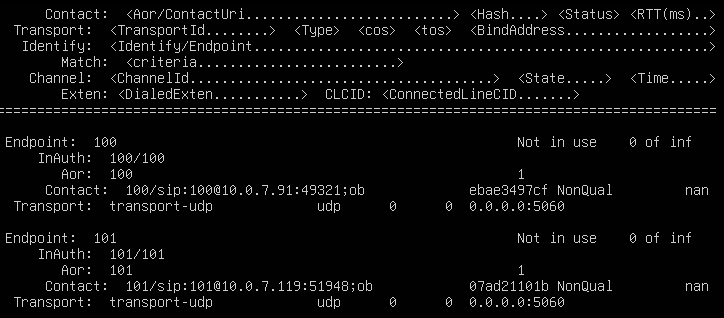
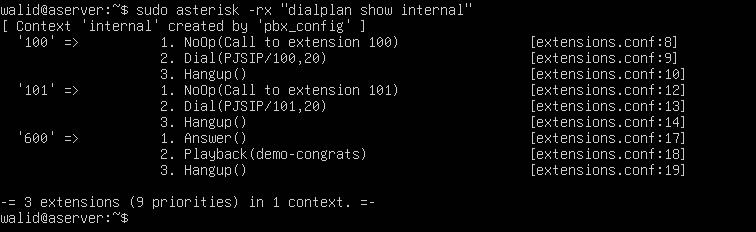
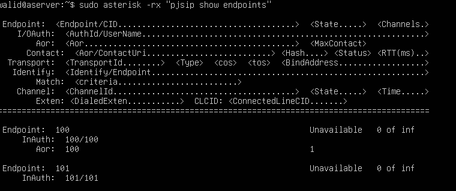

Setting Up a VoIP PBX with Asterisk on Ubuntu
========================
## Prerequisites

- Ubuntu 22.04 (or 20.04) (physical machine, VM, or WSL2)
- Basic Linux command-line knowledge (editing files with `vim` or `nano`, running `sudo`)
- At least 1 GB RAM and 10 GB disk space
- Two softphone clients (e.g. [MicroSIP](https://www.microsip.org/) on Windows)
> **VMware/VirtualBox tip:** Set your VM's network adapter to **Bridged** mode so softphones on your host machine or other devices on the same LAN can reach the Asterisk server directly.

## step 1 - update Ubuntu
```bash
sudo apt update && sudo apt upgrade -y
```
## step 2 - install asterisk
```bash
sudo apt install -y asterisk asterisk-config asterisk-core-sounds-en
```
## Step 3 - start and verify service

```bash
sudo systemctl enable --now asterisk
sudo systemctl status asterisk --no-pager
asterisk -V
```
To enter the Asterisk CLI :
```bash
 sudo asterisk -rvvv
```
to exit the CLI :
```bash
exit
```
## Step 4 - backup of default conf
Before making any changes, back up the default config files so you can restore them if needed:
```bash
sudo cp /etc/asterisk/pjsip.conf /etc/asterisk/pjsip.conf.bak
sudo cp /etc/asterisk/extensions.conf /etc/asterisk/extensions.conf.bak
```
## Step 5 - configure 2 SIP extensions with PJSIP

Two files control how Asterisk handles SIP accounts and calls:

| File | Purpose |
|------|---------|
| `/etc/asterisk/pjsip.conf` | SIP accounts and transport settings |
| `/etc/asterisk/extensions.conf` | Dialplan |

### Step 5.1 - Edit pjsip.conf
```bash
sudo vim /etc/asterisk/pjsip.conf
```
Paste the following configuration:
```ini
[global]
type=global

[transport-udp]
type=transport
protocol=udp
bind=0.0.0.0:5060

; =========================
; Extension 100
; =========================
[100]
type=endpoint
transport=transport-udp
context=internal
disallow=all
allow=ulaw,alaw
auth=100
aors=100

[100]
type=auth
auth_type=userpass
username=100
password=1234

[100]
type=aor
max_contacts=1

; =========================
; Extension 101
; =========================
[101]
type=endpoint
transport=transport-udp
context=internal
disallow=all
allow=ulaw,alaw
auth=101
aors=101

[101]
type=auth
auth_type=userpass
username=101
password=1234

[101]
type=aor
max_contacts=1
```
### Step 5.2 - Edit extensions.conf
```bash
sudo vim /etc/asterisk/extensions.conf
```
Paste the following dialplan:
```ini
[general]
static=yes
writeprotect=no

[globals]

[internal]
exten => 100,1,NoOp(Call to extension 100)
 same => n,Dial(PJSIP/100,20)
 same => n,Hangup()

exten => 101,1,NoOp(Call to extension 101)
 same => n,Dial(PJSIP/101,20)
 same => n,Hangup()

; test extension
exten => 600,1,Answer()
 same => n,Playback(demo-congrats)
 same => n,Hangup()
```
## Step 6 - Reload Asterisk Configuration
After editing the config files, reload Asterisk without restarting the service:

```bash
# Reload SIP accounts
sudo asterisk -rx "pjsip reload"
 
# Reload dialplan
sudo asterisk -rx "dialplan reload"
```
Verify the extensions are registered:
 
```bash
sudo asterisk -rx "pjsip show endpoints"
```
**Expected output:**

> 


Verify the dialplan:
 
```bash
sudo asterisk -rx "dialplan show internal"
```
**Expected output:**

> 

## Step 7 -  Open firewall (if UFW is enabled)

Check if UFW is active:

```bash
sudo ufw status
```

If it is active, allow SIP signaling and RTP audio traffic:

```bash
sudo ufw allow 5060/udp
sudo ufw allow 10000:20000/udp
sudo ufw reload
```
## STEP 8 - Connect two softphones

Use MicroSIP (Windows) or any SIP-compatible softphone. Register two accounts using the credentials below.
 
> Replace `10.0.7.27` with your Ubuntu server's actual IP address (find it with `ip a`).
 
**Extension 100:**
 
| Field | Value |
|-------|-------|
| Username | 100 |
| Password | 1234 |
| SIP Server / Domain | 10.0.7.27 |
| Port | 5060 |

 
**Extension 101:**
 
| Field | Value |
|-------|-------|
| Username | 101 |
| Password | 1234 |
| SIP Server / Domain | 10.0.7.27 |
| Port | 5060 |
 
**Test calls:**
- From 100, dial `101`
- From 101, dial `100`
- From either extension, dial `600` to hear the test audio

## Troubleshooting
 
### Error: Extension shows "Unavailable" in `pjsip show endpoints`
 
> 

 
**Cause:** The softphone has not registered yet, or the credentials are wrong.
 
**Fix:**
- Double-check username/password in the softphone and `pjsip.conf`
- Make sure the softphone is pointing to the correct server IP and port 5060
- Check registration status: `sudo asterisk -rx "pjsip show registrations"`
 
### One-Way Audio (you can hear them but they can't hear you, or vice versa)
 
**Cause:** NAT or RTP port range issue — the server sends audio to the wrong IP or the firewall blocks RTP.
 
**Fix:**
- Make sure ports `10000–20000/udp` are open (Step 7)
- If using a VM, confirm the adapter is in **Bridged** mode (not NAT)
- Add `local_net` and `external_media_address` to `pjsip.conf` if behind NAT
 
### Call goes through but hangs up immediately
 
**Cause:** Codec mismatch, the softphone is offering a codec that Asterisk has not allowed.
 
**Fix:** In the softphone settings, set the audio codec to **G.711 µ-law (PCMU)** or **G.711 a-law (PCMA)**, which matches `allow=ulaw,alaw` in `pjsip.conf`.
 
 
## Summary
 
| Step | What Was Done |
|------|---------------|
| 1–3 | Installed and started Asterisk |
| 4 | Backed up default config |
| 5 | Configured PJSIP extensions and dialplan |
| 6 | Reloaded config and verified endpoints |
| 7 | Opened firewall ports for SIP and RTP |
| 8 | Registered softphones and tested calls |


